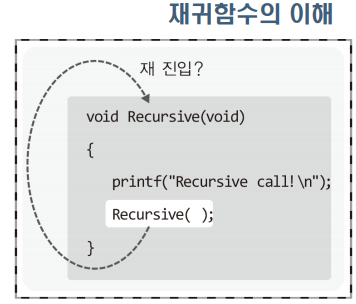
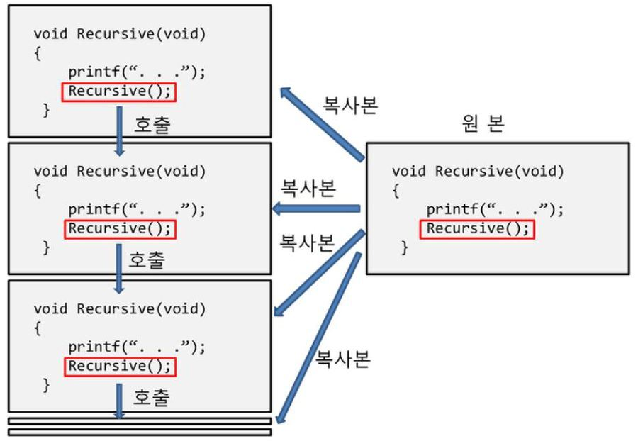

## 함수의 재귀적 호출의 이해
---
목차

+ [재귀함수의 기본적인 이해](#재귀함수의-기본적인-이해)

---
#### 재귀함수의 기본적인 이해
> 재귀함수란 함수 내에서 자기 자신을 다시 호출하는 함수를 의미한다.
~~~ C
void Recursive(void)
{
    printf("Recursive call! \n");
    Recursive();  //나 자신을 재 호출한다.
}
~~~

`위의 방식으로 재귀함수의 흐름을 파악하기 쉽지 않은 이유는 완료되지 않은 함수를 다시 호출하는 것이 논리적으로 이치에 맞지 않는 것 같아 보이기 때문이다.`
`따라서 아래의 그림으로 이해하길 권장되고 있다.`

> 위 그림에선 Recursive 함수가 호출되면, Recursive 함수의 복사본이 만들어져서 복사본이 실행되는 구조로 재귀함수의 호출을 설명하고 있다
> Recursive 함수를 실행하는 중간에 다시 Recursive 함수가 호출되면,
> Recursive 함수의 복사본을 하나 더 만들어서 복사본을 실행하는 흐름이다.

- 실제로 함수를 구성하는 명령문은 CPU로 이동이 되어서(복사가 되어서) 실행이 된다. Recursive 함수의 중간쯤 위치한 명령문을 실행하다가 다시 Recursive 함수의 앞 부분에 위치한 명령문을 CPU로 이동시키는 것은 문제가 되지 않는다. 

~~~ C
#include <stdio.h>

void Recursive(int num){
    if(num <= 0) // 재귀의 탈출 조건 
        return;  // 재귀의 탈출
    printf("Recursive call! %d \n", num);
    Recursive(num-1);
}

int main(void){
    Recursive(4);
    return 0;
}
~~~
- 실행결과: RecursiveFunc.c
  > \> Recursive call! 4
  > \> Recursive call! 3
  > \> Recursive call! 2
  > \> Recursive call! 1

- 상기 프로그램의 실행 순서

#### 재귀 함수의 디자인 사례
  > 재귀함수는 자료구조나 알고리즘의 어려운 문제를 단순화하는데 사용되는 중요한 무기이다. 무엇보다도 재귀함수가 있기에 재귀적인 수학적 수식을 그대로 코드로 옮길 수 있다.
- 팩토리얼(factorial)의 재귀적 구현
  - 팩토리얼의 수식적 의미
    $n!=n\times(n-1)\times(n-2)\times(n-3)\times. . . .\times2\times1$
    => $n! = n\times(n-1)!$

